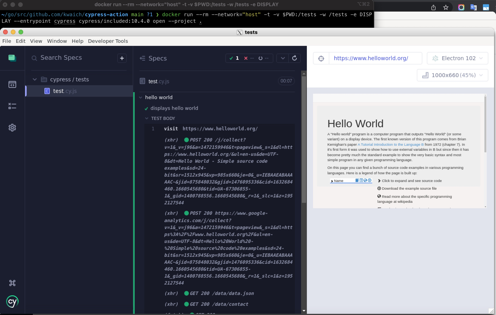

# cypress-action

PoC for web integration tests using Cypress that runs as a part of CI

## About Workflows

[.github/workflows/test.yml](.github/workflows/test.yml) has settings for 'on push' jobs

[.github/workflows/schedule.yml](.github/workflows/schedule.yml) has settings for scheduled jobs, scheduled every 12 hour.

## Getting started

Clone the repository and setup the toolchain:
```shell
$ git clone git@github.com:kwaich/cypress-action.git
$ cd cypress-action
```

Run headless tests locally:
```shell
$ docker run --rm --network="host" -t -v $PWD:/tests -w /tests cypress/included:10.4.0
```

## Run Test Runner

To start Cypress Test Runner (just like `cypress open` does), you need to:

- set up X11 server on the host machine, for example using [XQuartz](https://www.xquartz.org) following the [Running GUI applications using Docker for Mac](https://sourabhbajaj.com/blog/2017/02/07/gui-applications-docker-mac/)
- set the `IP` variable and allow X11 server to accept incoming connections from that network address

```shell
IP=$(ipconfig getifaddr en0)
/usr/X11/bin/xhost + $IP
```

- set the `DISPLAY` variable and pass it to the `docker run` when running

```shell
DISPLAY=$IP:0
docker run --rm --network="host" -t -v $PWD:/tests -w /tests -e DISPLAY --entrypoint cypress cypress/included:10.4.0 open --project .
```

You should see Cypress open and be able to run tests, change files, see tests rerun.



## More Information

- [Run Cypress with a single Docker command](https://www.cypress.io/blog/2019/05/02/run-cypress-with-a-single-docker-command/)
- [End-to-End Testing Web Apps: The Painless Way](https://mtlynch.io/painless-web-app-testing/)
